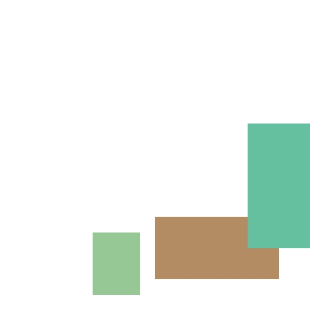
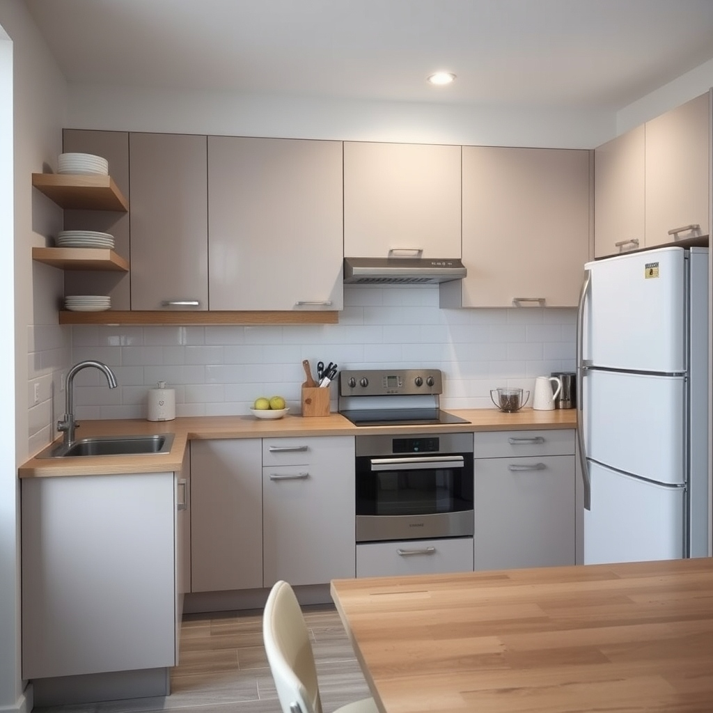
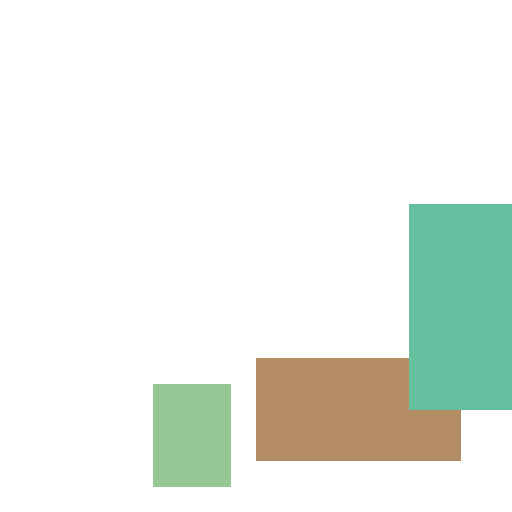
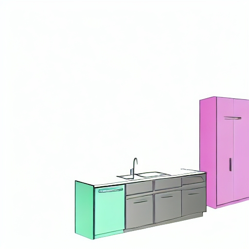

# 🎨 LayoutGen — Layout-Aware AI Image Generation

**LayoutGen** converts structured JSON layout descriptions into realistic images using Stable Diffusion. It bridges the gap between spatial data and creative image synthesis — turning bounding-box coordinates and scene labels into natural-language prompts, then generating images via Hugging Face Inference API or local GPU pipelines.

---

## ✨ Features

- 📐 **Layout Visualization** — Renders bounding boxes from JSON onto a color-coded canvas before generation
- 🧠 **Smart Prompt Generation** — Converts spatial coordinates (normalized or pixel-based) into descriptive natural-language prompts
- 🖼️ **Two Generation Modes**:
  - **Baseline (Text-to-Image)** — Generates from the prompt alone  
  - **Layout-Guided (Img2Img)** — Uses the layout sketch as a structural reference
- ☁️ **Hugging Face Inference API** — Lightweight mode; no local model downloads required
- 💻 **Local GPU / Google Colab** — Full offline support for GPU-equipped users
- 📊 **Layout Optimizer & Evaluator** — Backend utilities to refine and assess layouts before generation

---

## 🏗️ Architecture

```
JSON Layout Input
       │
       ▼
prompt_generator.py  ──►  Natural Language Prompt
       │
layout_to_image.py   ──►  Layout Sketch (PIL bounding boxes)
       │
       ▼
Stable Diffusion (Text2Img or Img2Img)
       │
       ▼
Generated Image Output
```

| Layer | Component | Role |
|---|---|---|
| Frontend | `frontend/app.py` | Streamlit UI — upload, configure, visualize, generate |
| Backend | `backend/prompt_generator.py` | Converts JSON layout → natural language prompt |
| Backend | `backend/layout_to_image.py` | PIL visualization + HF API + local Diffusers pipeline |
| Backend | `backend/layout_optimizer.py` | Pre-generation layout refinement utilities |
| Backend | `backend/evaluate_layout.py` | Layout quality evaluation |
| Notebooks | `notebooks/layoutgen_colab.ipynb` | GPU-accelerated generation on Google Colab |

---

## 📂 Project Structure

```text
LayoutGen/
├── app.py                        # Root entry point (for HF Spaces)
├── frontend/
│   └── app.py                    # Streamlit UI (main interface)
├── backend/
│   ├── prompt_generator.py       # Layout JSON → natural language prompt
│   ├── layout_to_image.py        # Visualization, HF API, local Diffusers
│   ├── layout_optimizer.py       # Layout pre-processing & refinement
│   └── evaluate_layout.py        # Layout quality evaluation
├── notebooks/
│   └── layoutgen_colab.ipynb     # Google Colab GPU notebook
├── outputs/                      # Saved generated images
├── requirements.txt              # Python dependencies
└── README.md
```

---

## 🚀 Getting Started

### Option 1 — Hugging Face Inference API (Recommended, No GPU Needed)

No large model downloads. Just a free HF token.

**Step 1**: Get your token  
- Sign up at [huggingface.co](https://huggingface.co)  
- Go to [Settings → Access Tokens](https://huggingface.co/settings/tokens)  
- Create a token with **Read** permissions

**Step 2**: Install dependencies

```bash
pip install streamlit requests pillow huggingface_hub
```

**Step 3**: Run the app

```bash
streamlit run frontend/app.py
```

**Step 4**: In the sidebar, select **"Hugging Face API"**, pick a model, and enter your token.

---

### Option 2 — Local GPU / CPU

Runs the full Stable Diffusion pipeline locally. Requires several GBs of model downloads.

```bash
pip install -r requirements.txt
streamlit run frontend/app.py
```

Then select **"Local (Requires GPU/Colab)"** in the sidebar.

---

### Option 3 — Google Colab (No Local GPU)

1. Open `notebooks/layoutgen_colab.ipynb` in [Google Colab](https://colab.research.google.com/)
2. Set the runtime to **GPU** (Runtime → Change runtime type → T4 GPU)
3. Use the Streamlit app to generate a prompt from your layout JSON
4. Paste the prompt into the Colab notebook to generate the image

---

## 🖼️ Example Outputs

**Input JSON:**
```json
{
  "scene": "a modern kitchen",
  "objects": [
    { "label": "table",        "x": 0.5, "y": 0.70, "width": 0.40, "height": 0.20 },
    { "label": "chair",        "x": 0.3, "y": 0.75, "width": 0.15, "height": 0.20 },
    { "label": "refrigerator", "x": 0.8, "y": 0.40, "width": 0.20, "height": 0.40 }
  ]
}
```

### 1. Baseline Text-to-Image Mode
Generates an image purely based on the generated prompt, without strictly restricting the generated layout to bounding boxes.

| Layout Sketch (Visualization) | Final Generative Result |
|---|---|
|  |  |

### 2. Layout-Guided Img2Img Mode
Uses the exact underlying layout sketch as a structural constraint to strictly enforce object positioning.

| Layout Sketch (Visualization) | Final Generative Result |
|---|---|
|  |  |

---

## 📄 JSON Input Format

LayoutGen accepts two coordinate styles:

### Normalized Coordinates (recommended) — values in `[0.0, 1.0]`

`x` and `y` represent the **center** of the object as a fraction of the image dimensions.

```json
{
  "scene": "a modern kitchen",
  "objects": [
    { "label": "table",        "x": 0.5, "y": 0.70, "width": 0.40, "height": 0.20 },
    { "label": "chair",        "x": 0.3, "y": 0.75, "width": 0.15, "height": 0.20 },
    { "label": "refrigerator", "x": 0.8, "y": 0.40, "width": 0.20, "height": 0.40 }
  ]
}
```

### Pixel Coordinates — absolute pixel values

```json
{
  "title": "A serene living room",
  "objects": [
    { "label": "blue sofa", "bbox": [100, 300, 400, 200] }
  ]
}
```

> `bbox` format: `[x, y, width, height]` where `x, y` is the top-left corner.

### Nested Android UI Format

Also supports nested layout trees with `bounds`, `componentLabel`, and `children` keys (e.g., from RICO dataset exports).

---

## 🖼️ Supported Models

| Model | Best For |
|---|---|
| `black-forest-labs/FLUX.1-schnell` | Stunning aesthetics (text-to-image) |
| `runwayml/stable-diffusion-v1-5` | General purpose, fast |
| `stabilityai/stable-diffusion-2-1` | Higher resolution outputs |
| `stabilityai/stable-diffusion-xl-base-1.0` | High-quality detailed images |

> ⚠️ The free Hugging Face Inference API **does not support image-to-image** tasks. For Layout-Guided (Img2Img) mode, use **Local** or **Colab** mode.

---

## ⚙️ Generation Modes

| Mode | Description | API Support |
|---|---|---|
| **Baseline (Text-to-Image)** | Generates from the natural language prompt only | ✅ HF API + Local |
| **Layout-Guided (Img2Img)** | Uses the layout sketch as structural guidance | ❌ Local / Colab only |

The **Img2Img Strength** slider (0.1–1.0) controls how strictly the layout is followed:
- **Low (0.3–0.5)** → Preserves layout structure more closely
- **High (0.7–1.0)** → Allows more AI creativity

---

## 🛠️ Requirements

```
streamlit
requests
pillow
huggingface_hub
diffusers
transformers
torch
accelerate
```

Install all at once:
```bash
pip install -r requirements.txt
```

- Python **3.8+**
- CUDA-capable GPU recommended for local generation

---

## 📊 How Prompt Generation Works

`prompt_generator.py` converts bounding box positions into spatial language:

1. Extracts objects from JSON (supports `bbox`, `x/y/width/height`, and nested formats)
2. Computes relative positions within the scene bounds
3. Maps positions to directional labels: `top/middle/bottom` × `left/center/right`
4. Groups duplicate labels and pluralizes them
5. Returns a clean prompt like:

```
a modern kitchen featuring: a table bottom center, a chair bottom left, a refrigerator middle right.
```

---

## 📝 License

This project is open-source and available under the [MIT License](LICENSE).
